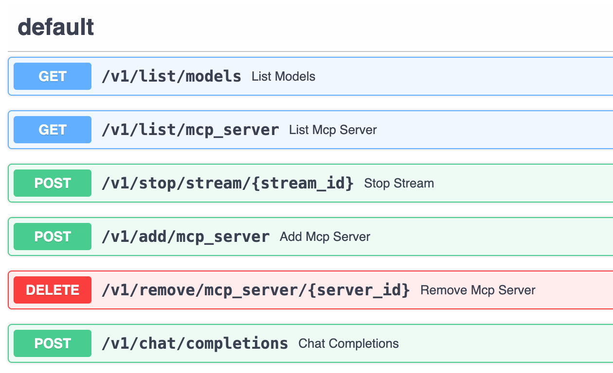
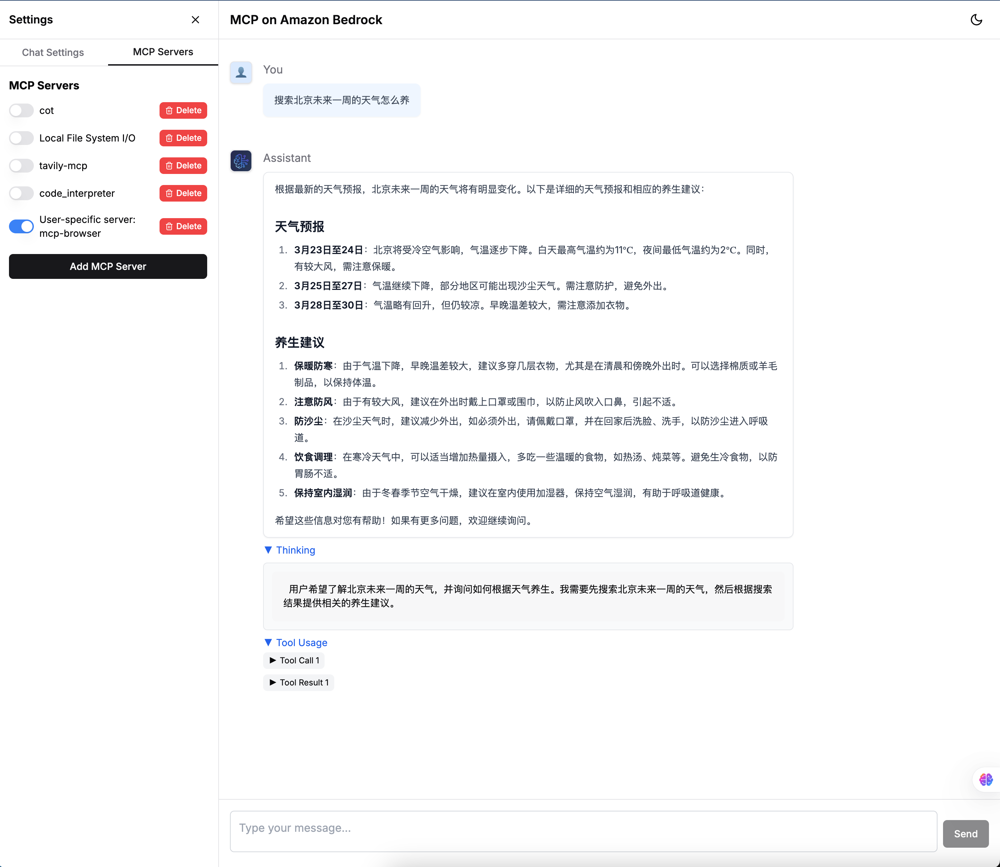

# MCP on Amazon Bedrock[[English Readme](./README.en.md)]
### 更新日志
- [20250527] 增加DeepSeek-R1支持（使用PE实现function call）
  - 针对中国区使用硅基流动api，或者其他openai兼容api，可以支持deepseek r1，通过PE方式实现了function call

- [20250516] 增加streamable http（简单token方式鉴权）
  - 目前只支持简单的Beaer token方式验证，配置示例：add server添加json配置 
  ```json
  {
    "mcpServers": {
      "MCPServerApi": {
        "url": "https://xxx.execute-api.us-east-1.amazonaws.com/Prod/mcp",
        "token":"123456"
      }
    }
  }
  ``` 
  可以用aws lambda开发部署serverless http stream sever，参考示例：https://github.com/mikegc-aws/Lambda-MCP-Server

- [20250507] 新增Nova Premier和Nova Sonic 语音Agent模式，见第6节介绍
 - ⚠️ 如果在ec2部署，需要使用[HTTPS方式部署](HTTPS_SETUP.md)，如果在本地则沿用之前的部署方式.

- [20250419] Keep Server Session 功能，可以在服务器端保存session所有历史消息，包括（Tool use历史）
  - UI开启方法：UI上通过`Keep Session on Server`开关控制,点击`Clear Conversion`时，会向服务端发起`v1/remove/history`请求清空服务器session消息。
  - 如果直接使用服务端接口，在ChatCompletionRequest中加入keep_session=True,表示在服务端保存，messages中只需要传入system和最新的user 即可，无须再传入历史消息。
  - 如果要清空服务器端历史，需要发起`POST v1/remove/history`请求
  
- [20250418] 新增中国区硅基流动deepseek v3,Qwen3模型支持，新增sse server支持
  - 注意如果是升级安装，需要运行`uv sync`更新依赖环境
  - .env中加入use_bedrock=0

- Demo Vides


> ChatBot 是大模型时代最常见的应用形态，但受限于大模型无法获取及时信息、无法操作外部系统等，使得 ChatBot 应用场景相对有限。后来随着 Function Calling/Tool Use 功能推出，大模型能够跟外部系统交互，但弊端在于大模型业务逻辑和 Tool 开发都是紧密耦合的，无法发挥出 Tool 端规模化的效率。Anthropic 2024 年 11 月底推出 [MCP](https://www.anthropic.com/news/model-context-protocol) 打破了这一局面，引入整个社区的力量在 Tool 端规模化发力，目前已经有开源社区、各路厂商等开发了丰富的 [MCP server](https://github.com/modelcontextprotocol/servers)，使得 Tool 端蓬勃发展。终端用户即插即用就可将其集成到自己的 ChatBot 中，极大延展了 ChatBot UI 的能力，有种 ChatBot 一统各种系统 UI 的趋势。
- MCP 如何工作  
  

- 基于AWS的MCP企业架构设计思路  
 

- 本项目提供基于 **Bedrock** 中Nova,Claude等大模型的 ChatBot 交互服务，同时引入 **MCP**，极大增强并延伸 ChatBot 形态产品的应用场景，可支持本地文件系统、数据库、开发工具、互联网检索等无缝接入。如果说包含大模型的 ChatBot 相当于大脑的话，那引入 MCP 后就相当于装上了胳膊腿，真正让大模型动起来、跟各种现存系统和数据联通。  

- **本Demo方案架构**


- **Deepwiki** 

https://deepwiki.com/aws-samples/demo_mcp_on_amazon_bedrock/1.1-system-architecture

- **核心组件**
   
   1. MCP客户端(mcp_client.py)
      - 负责管理与多个MCP服务器的连接
      - 处理工具调用和资源访问
      - 提供工具名称映射和规范化功能
   2. 聊天客户端(chat_client.py,chat_client_stream.py)
      - 与Amazon Bedrock API交互
      - 处理用户查询和模型响应
      - 支持流式响应和工具调用
   3. 主服务(main.py)
      - 提供FastAPI服务,暴露聊天和MCP管理API
      - 管理用户会话和MCP服务器配置
      - 处理并发请求和资源清理
   4. Frontend(React UI)
      - 基于React的用户界面
      - 允许用户与模型交互并管理MCP服务器
      - 显示工具调用结果和思考过程

- **技术架构**
   1. 前后端分离
      - 后端:FastAPI服务提供RESTAPI
      - 前端:Streamlit Web界面
   2. 多用户支持
      - 用户会话隔离
      - 支持并发访问
   3. MCP服务器管理
      - 支持动态添加和移除MCP服务器
      - 全局和用户特定的MCP服务器配置

- **工作流程**
  
   1. 用户通过Web界面发送查询
   2. 后端服务接收查询并转发给Bedrock模型
   3. 如果模型需要使用工具,MCP客户端会调用相应的MCP服务器
   4. 工具调用结果返回给模型,模型生成最终响应
   5. 响应返回给用户,包括工具调用过程和结果

- 该项目目前仍在不断探索完善，MCP 正在整个社区蓬勃发展，欢迎大家一起关注！

## 1. 项目特点：
   - 同时支持Amazon Nova 和Claude Sonnet模型, 以及其他OPENAI接口兼容的模型
   - 与Anthropic官方MCP标准完全兼容，可以采用同样的方式，直接使用社区的各种[MCP servers](https://github.com/modelcontextprotocol/servers/tree/main)
   - 将MCP能力和客户端的解耦，MCP能力封装在服务端，对外提供API服务，且chat接口兼容openai，方便接入其他chat客户端
   - 前后端分离，MCP Client和MCP Server均可以部署到服务器端，用户可以直接使用web浏览器通过后端web服务交互，从而访问LLM和MCP Sever能力和资源  
   - 支持多用户，用户session隔离，支持并发访问。
   - 流式响应
   - 思考过程可视化
   - 工具调用结果展示和Computer Use截图展示


## 2. 安装步骤
### 2.1. 依赖安装

目前主流 MCP Server 基于 NodeJS 或者 Python 开发实现并运行于用户 PC 上，因此用户 PC 需要安装这些依赖。

### 2.1 NodeJS

NodeJS [下载安装](https://nodejs.org/en)，本项目已对 `v22.12.0` 版本充分测试。

### 2.2 Python

有些 MCP Server 基于 Python 开发，因此用户必须安装 [Python](https://www.python.org/downloads/)。此外本项目代码也基于 Python 开发，需要安装环境和依赖。

首先，安装 Python 包管理工具 uv，具体可参考 [uv](https://docs.astral.sh/uv/getting-started/installation/) 官方指南，本项目已对 `v0.5.11` 版本充分测试。

### 2.3 环境配置
下载克隆该项目后，进入项目目录创建 Python 虚拟环境并安装依赖：
```bash
sudo apt update
sudo apt-get install clang
sudo apt-get install portaudio19-dev
uv sync
```

如果是mac环境:  
```bash
brew install portaudio
uv sync
```

此时项目目录的 `.venv` 中就创建好了虚拟环境,激活
```
source .venv/bin/activate
```

- （可选）使用aws cli工具创建一个dynamodb table用于保存user config信息，如果不创建dynamodb，则直接生成user_mcp_config.json保存在conf/目录下
```bash
aws dynamodb create-table \
    --table-name mcp_user_config_table \
    --attribute-definitions AttributeName=userId,AttributeType=S \
    --key-schema AttributeName=userId,KeyType=HASH \
    --billing-mode PAY_PER_REQUEST 
```
### 2.4 配置编辑（海外区使用Bedrock）
> Tips: 如何需要配置多个账号ak/sk, 使用轮询机制，可以在conf/目录下增加一个`credential.csv`, 列名分别为**ak**，**sk**， 填入多个ak/sk即可，例如: 
ak,sk  
ak1,sk1  
ak2,sk2  

运行以下命令创建.env 文件， **请修改AWS_ACCESS_KEY_ID,AWS_SECRET_ACCESS_KEY,AWS_REGION等信息之后再运行**  

```bash
cat << EOF > .env
AWS_ACCESS_KEY_ID=(可选，如果有credential.csv则不需要)
AWS_SECRET_ACCESS_KEY=(可选)<your-secret-key>
AWS_REGION=<your-region>
LOG_DIR=./logs
CHATBOT_SERVICE_PORT=8502
MCP_SERVICE_HOST=127.0.0.1
MCP_SERVICE_PORT=7002
API_KEY=123456
MAX_TURNS=200
INACTIVE_TIME=60
#如果不使用dynamodb，则删除下面一行
ddb_table=mcp_user_config_table
USE_HTTPS=0
EOF
```

备注：该项目用到 **AWS Bedrock Nova/Claude** 系列模型，因此需要注册并获取以上服务访问密钥。

### 2.5 配置编辑（中国区使用硅基流动API）
> Tips: 中国区需要提前获取硅基流动API Key

运行以下命令创建.env 文件， **注意：请修改COMPATIBLE_API_KEY,COMPATIBLE_API_BASE等信息之后再运行**

```bash
cat << EOF > .env
COMPATIBLE_API_KEY=<硅基流动的apikey>
COMPATIBLE_API_BASE=https://api.siliconflow.cn
LOG_DIR=./logs
CHATBOT_SERVICE_PORT=8502
MCP_SERVICE_HOST=127.0.0.1
MCP_SERVICE_PORT=7002
API_KEY=123456
MAX_TURNS=200
INACTIVE_TIME=10
#不使用bedrock flag
use_bedrock=0
#如果不使用dynamodb，则删除下面一行
ddb_table=mcp_user_config_table
USE_HTTPS=0
EOF
```

默认配置支持`DeepSeek-V3`,`Qwen3`等模型, 如果需要支持其他模型（必须是支持tool use的模型），请自行修改[conf/config.json](conf/config.json)配置加入模型，例如：

```json
  {
    "model_id": "Qwen/Qwen3-235B-A22B",
    "model_name": "Qwen3-235B-A22B"
  },
  {
    "model_id": "Qwen/Qwen3-30B-A3B",
    "model_name": "Qwen3-30B-A3B"
  },
  {
    "model_id": "Pro/deepseek-ai/DeepSeek-V3",
    "model_name": "DeepSeek-V3-Pro"
  },
  {
    "model_id": "deepseek-ai/DeepSeek-V3",
    "model_name": "DeepSeek-V3-free"
  }
```


## 3. 运行

### 3.1 该项目包含1个后端服务和一个React UI前端， 前后端通过rest api对接：
- **Chat 接口服务（Bedrock+MCP）**，可对外提供 Chat 接口、同时托管多个 MCP server、支持历史多轮对话输入、响应内容附加了工具调用中间结果、暂不支持流式响应
- **Web UI**，跟上述 Chat 接口服务通信，提供多轮对话、管理 MCP 的 Web UI 演示服务

### 3.2 (可选)HTTPS方式启动
参考 [HTTPS_SETUP](./HTTPS_SETUP.md)

### 3.2 Chat 接口服务（Bedrock+MCP）
- 接口服务可以对外提供给独立API，接入其他chat客户端, 实现服务端MCP能力和客户端的解耦
- 可以通过http://{ip}:7002/docs#/查看接口文档.


- 编辑配置文件 `conf/config.json`，该文件预设了要启动哪些 MCP server，可以编辑来添加或者修改 MCP server 参数。
- 每个 MCP server 的参数规范，可参考如下示例： 
```
"db_sqlite": {
    "command": "uvx",
    "args": ["mcp-server-sqlite", "--db-path", "./tmp/test.db"],
    "env": {},
    "description": "DB Sqlite CRUD - MCP Server",
    "status": 1
}
```

- 启动服务：
```bash
bash start_all.sh
```

- 停止服务:
```bash
bash stop_all.sh
```

- 待启动后，可查看日志 `logs/start_mcp.log` 确认无报错，然后可运行测试脚本检查 Chat 接口：
```bash
# 脚本使用 Bedrock 的 Amazon Nova-lite 模型，也可更换其它
# 默认使用123456作为API key, 请根据实际设置更改
curl http://127.0.0.1:7002/v1/chat/completions \
  -H "Content-Type: application/json" \
  -H "Authorization: Bearer 123456" \
  -H "X-User-ID: user123" \
  -d '{
    "model": "us.amazon.nova-pro-v1:0",
    "mcp_server_ids":["local_fs"],
    "stream":true,
    "keep_session":false,
    "messages": [
      {
        "role": "user",
        "content": "list files in current dir"
      }
    ]
  }'
```
- 如果keep_session:true表示在服务器端保持session，服务器会保留历史消息和工具调用，客户端只需传入最新一轮的user message即可

### 3.3 Web UI 
* 之前的streamlit UI 已经deprecated
现在启用新版React UI
- 🚀 基于Next.js 15和React 18构建的现代化前端，支持Dark/Light模式
- 🎨 使用Tailwind CSS和Shadcn UI组件库实现美观的用户界面
- 🔄 实时流式响应，提供流畅的对话体验
- 🧠 支持"思考"模式，展示模型的推理过程
- 🛠️ MCP服务器管理功能，支持添加和配置服务器
- 👤 用户会话管理，保持对话上下文
- 📊 可视化工具使用结果，包括图像显示
- 📱 支持多模态输入，包括图片，pdf，文档等附件上传
- [安装步骤](react_ui/README.md)



#### ChatBot UI (Deprecated)
待启动后，可查看日志 `logs/start_chatbot.log` 确认无报错，然后浏览器打开[服务地址](http://localhost:3000/chat)，即可体验 MCP 增强后的 Bedrock 大模型 ChatBot 能力。
由于已内置了文件系统操作、SQLite 数据库等 MCP Server，可以尝试连续提问以下问题进行体验：

```
show all of tables in the db
how many rows in that table
show all of rows in that table
save those rows record into a file, filename is rows.txt
list all of files in the allowed directory
read the content of rows.txt file
```

### 3.4. 添加 MCP Server
当前可以通过两种方式来添加 MCP Server：
1. 预置在 `conf/config.json`，每次重新启动 Chat 接口服务就会加载配置好的 MCP Server 
2. 通过 ChatBot UI 来添加 MCP Server，表单提交 MCP Server 参数即可，仅当前生效、服务重启后失效  
下面演示如何通过 ChatBot UI 添加 MCP Server，这里以 Web Search 供应商 [Exa](https://exa.ai/) 为例，开源社区已有针对它的 [MCP Server](https://github.com/exa-labs/exa-mcp-server) 可用。  
首先，前往 [Exa](https://exa.ai/) 官网注册账号，并获取 API Key。  
然后点击【添加 MCP Server】，在弹出菜单中填写如下参数并提交即可：  
- 方式1，直接添加MCP json 配置文件(与Anthropic官方格式相同)   
```json
{
  "mcpServers": {
    "exa": {
      "command": "npx",
      "args": ["-y","exa-mcp-server"],
      "env": {
        "EXA_API_KEY": "your-api-key-here"
      }
    }
  }
}
```
- 方式2，按字段添加 

此时在已有 MCP Server 列表中就可以看到新添加项，勾选即可启动该 MCP Server。

## 4. CDK安装（新增）
[README](cdk/README.me)

## 5 Demo cases
### 5.1.使用MCP操作Browser浏览器 
- 在chatbot界面上添加这个json文件,注意：这个[browser use](https://github.com/vinayak-mehta/mcp-browser-use)server默认启动有头模式的浏览器，因此适合在本地电脑部署的demo中，如果在服务器端部署，请在提示词里加一句`use headless is true to initialize the browser`
**注意** 第一次运行时，需要在服务安装对应的依赖包 `sudo apt-get install libgbm1`  
```json
{ "mcpServers": 
	{ "mcp-browser": 
		{ "command": "uvx", 
        "args": ["mcp-browser-use"],
        "env": {},
        "description": "mcp-browser"
		} 
	} 
}
```  

- **New added 20250331** 使用MS官方[playwright](https://mcp.so/server/playwright-mcp/microsoft):   
**注意** 如果需要无头模式则添加"--headless"参数，第一次运行时，需要在服务安装对应的依赖包 `npx playwright install chrome`  
```json
{
  "mcpServers": {
    "playwright": {
      "command": "npx",
      "args": [
        "@playwright/mcp@latest",
        "--headless"
      ]
    }
  }
}
```

- test 1, 在chatbot界面中，勾选mcp-browser和local file system 2个server  
输入任务：`帮我整理一份关于小米SU7 ultra的介绍，包括性能，价格，特色功能，图文并茂，并制作成精美的HTML保存到本地目录中.如果引用了其他网站的图片，确保图片真实存在，并且可以访问。`  
[视频demo](https://mp.weixin.qq.com/s/csg7N8SHoIR2WBgFOjpm6A)  
[最终输出文件示例](docs/xiaomi_su7_ultra_intro.html)  
  - 如果第一次运行可能需要额外安装一些软件，请跟进tool call 返回的信息提示安装即可  

- test 2, 在chatbot界面中，勾选exa,mcp-browser和local file system 3个server, 会结合搜索引擎，浏览器共同获取信息和图片，形成更丰富的报告
输入任务：`我想要一份特斯拉股票的全面分析，包括：概述：公司概况、关键指标、业绩数据和投资建议财务数据：收入趋势、利润率、资产负债表和现金流分析市场情绪：分析师评级、情绪指标和新闻影响技术分析：价格趋势、技术指标和支撑/阻力水平资产比较：市场份额和与主要竞争对手的财务指标对比价值投资者：内在价值、增长潜力和风险因素投资论点：SWOT 分析和针对不同类型投资者的建议。 并制作成精美的HTML保存到本地目录中。如果引用了其他网站的图片，确保图片真实存在，并且可以访问。 你可以使用mcp-browser和exa search去获取尽可能丰富的实时数据和图片。`   
[最终输出文件示例](docs/tesla_stock_analysis.html)  

- **时序图1:使用Headless Browser 的 MCP Server**
  

### 5.2 使用MCP Computer Use 操作 EC2 remote desktop
- 在另外一个目录中安装下载remote-computer-use
```bash
git clone https://github.com/aws-samples/aws-mcp-servers-samples.git
```
- 需要提前安装一台EC2实例，并配置VNC远程桌面。安装步骤请参考[说明](https://github.com/aws-samples/aws-mcp-servers-samples/blob/main/remote_computer_use/README.md)
- 环境配置好之后，在MCP demo客户端配置如下：
```json
{
    "mcpServers": {
        "computer_use": {
            "command": "uv",
            "env": {
                "VNC_HOST":"",
                "VNC_PORT":"5901",
                "VNC_USERNAME":"ubuntu",
                "VNC_PASSWORD":"",
                "PEM_FILE":"",
                "SSH_PORT":"22",
                "DISPLAY_NUM":"1"
            },
            "args": [
                "--directory",
                "/absolute_path_to/remote_computer_use",
                "run",
                "server_claude.py"
            ]
        }
    }
}
```
- 使用Computer Use推荐用Claude 3.7模型，并添加如下system prompt  

```plaintext
You are an expert research assistant with deep analytical skills.
you have capability:
<SYSTEM_CAPABILITY>
* You are utilising an Ubuntu virtual machine using Linux architecture with internet access.
* You can feel free to install Ubuntu applications with your bash tool. Use curl instead of wget.
* When viewing a page it can be helpful to zoom out so that you can see everything on the page.  Either that, or make sure you scroll down to see everything before deciding something isn't available.
* When using your computer function calls, they take a while to run and send back to you.  Where possible/feasible, try to chain multiple of these calls all into one function calls request.
* You can double click to open firefox
</SYSTEM_CAPABILITY>
<IMPORTANT>
  * Don't assume an application's coordinates are on the screen unless you saw the screenshot. To open an application, please take screenshot first and then find out the coordinates of the application icon. 
  * When using Firefox, if a startup wizard or Firefox Privacy Notice appears, IGNORE IT.  Do not even click "skip this step".  Instead, click on the address bar where it says "Search or enter address", and enter the appropriate search term or URL there. Maximize the Firefox browser window to get wider vision.
  * If the item you are looking at is a pdf, if after taking a single screenshot of the pdf it seems that you want to read the entire document instead of trying to continue to read the pdf from your screenshots + navigation, determine the URL, use curl to download the pdf, install and use pdftotext to convert it to a text file, and then read that text file directly with your StrReplaceEditTool.
  * After each step, take a screenshot and carefully evaluate if you have achieved the right outcome. Explicitly show your thinking: "I have evaluated step X..." If not correct, try again. Only when you confirm a step was executed correctly should you move on to the next one.
</IMPORTANT>
```   

- **时序图:使用Computer Use 操作 EC2 Remote Desktop**  


### 5.3.使用Sequential Thinking + Search 做 Deep Research (主要针对Nova/Claude 3.5模型, Claude 3.7不需要)
- 同时启用 websearch(参考上面的EXA配置)和 [Sequential Thinking MCP Server](https://github.com/modelcontextprotocol/servers/tree/main/src/sequentialthinking)，目前已经预置了Sequential Thinking MCP Server在配置文件中, 启动后可以看到server名称是cot。  

- Sequential Thinking提供通过动态的结构化思维过程和反思，通过工具调用的促使模型按工具输入的要求进行结构化输出推理链条。
- EXA Search 同时提供关键词和向量检索搜索网络知识，并返回页面的上的详细内容。
- 测试问题
```
1. use search tool and sequential thinking to make comparison report between different agents frameworks such as autogen, langgraph, aws multi agents orchestrator
2. use sequential thinking and search tool to make me a travel plan to visit shanghai between 3/1/2025 to 3/5/2025. I will departure from Beijing
3. use sequential thinking to research what the key breakthroughs and future impact of deepseek r1
4. 搜索对比火山引擎，阿里百炼，硅基流动上的对外提供的deepseek r1 满血版的API 性能对比, 包括推理速度，TTFT， 最大context长度等。使用sequential thinking 工具
```
- 效果一览


- **时序图:使用Search API 的 MCP Server**  
  

###  5.3. 使用Amazon Knowledge Base
先在Bedrock console中创建或者使用已有的Bedrock，记下Knowledge Base Id  
Clone [AWS Knowledge Base Retrieval MCP Server](https://github.com/modelcontextprotocol/servers)到本地，并用[assets/aws-kb-retrieval-server/index.ts)](assets/aws-kb-retrieval-server/index.ts)下的文件替换 `src/aws-kb-retrieval-server/index.ts`里的文件。  
> 新文件把knowledgeBaseId通过环境变量指定，无须再通过对话传入。  

在新clone的servers目录下用如下命令打包  
```sh
docker build -t mcp/aws-kb-retrieval:latest -f src/aws-kb-retrieval-server/Dockerfile . 
```

然后在chatbot界面上添加这个json文件，注意env中的字段需要替换成自己的账号信息，以及Knowledge Base Id   
```json
{
  "mcpServers": {
    "aws-kb-retrieval": {
      "command": "docker",
      "args": [ "run", "-i", "--rm", "-e", "AWS_ACCESS_KEY_ID", "-e", "AWS_SECRET_ACCESS_KEY", "-e", "AWS_REGION", "-e", "knowledgeBaseId", "mcp/aws-kb-retrieval:latest" ],
      "env": {
        "AWS_ACCESS_KEY_ID": "YOUR_ACCESS_KEY_HERE",
        "AWS_SECRET_ACCESS_KEY": "YOUR_SECRET_ACCESS_KEY_HERE",
        "AWS_REGION": "YOUR_AWS_REGION_HERE",
        "knowledgeBaseId":"The knowledage base id"
      }
    }
  }
}
```

## 6. 语音Agent + MCP
- ⚠️ 如果在ec2部署，需要使用[HTTPS方式部署](HTTPS_SETUP.md)，如果在本地则沿用之前的部署方式.
- 点击小话筒，可以体验端到端语音Agent模式，在该模式下，使用的是[Nova Sonic Speech 2 Speech模型](https://docs.aws.amazon.com/nova/latest/userguide/speech.html)，目前仅支持英文对话和三种音色输出。
Nova Sonic模型支持Function call，所以也能添加MCP server，例如，开启tavily search 和 time mcp server之后，语音输出问“what is the weather of beijing”。可以看到Nova Sonic模型会监听话筒，并直接在输出语音回复，并同时把语音输入和输出转成文字显示到对话框中  

- 实时语音流程  


## 7. Awsome MCPs
- AWS MCP Servers Samples https://github.com/aws-samples/aws-mcp-servers-samples
- AWS Labs MCP Servers https://awslabs.github.io/mcp
- https://github.com/punkpeye/awesome-mcp-servers
- https://github.com/modelcontextprotocol/servers
- https://www.aimcp.info/en
- https://github.com/cline/mcp-marketplace
- https://github.com/xiehust/sample-mcp-servers
- https://mcp.composio.dev/
- https://smithery.ai/
- https://mcp.so/

## 9. [LICENSE](./LICENSE)